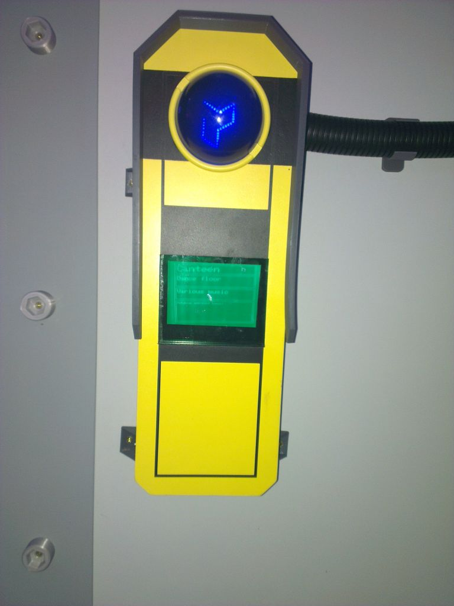

# InfoPointCode


This is the code used on the Infopoint displays in Cybar at EMFCamp 2022, after a bit of tidying up. It's really basic stuff built in the Arduino IDE, intended to run on an ESP32.

This is a mashup of standard example code, and work by [Charles Yarnold](https://twitter.com/CharlesYarnold), [Graham Sutherland](https://twitter.com/gsuberland) and [Nick Reynolds](https://twitter.com/ncmreynolds).

It was set to connect to the EMFCamp WPA2 Enterprise WiFi using standard credentials. To set your own WPA2 PSK credentials create a file called 'credentials.h' in the same directory as the rest, before compiling that looks something like this...

```
#ifndef CREDENTIALS_H
#define CREDENTIALS_H

// Replace with your actual SSID and password:
#define WIFI_SSID "Your SSID"
#define WIFI_PSK "Your PSK"

#endif
```


You need the following libraries to compile the code...

- ArduinoJson (https://github.com/bblanchon/ArduinoJson)
- ESP_8_BIT_composite (https://github.com/Roger-random/ESP_8_BIT_composite)
- FastLED (https://github.com/FastLED/FastLED)
- wordwrap (https://github.com/ncmreynolds/wordwrap)

...which should all be available from the Arduino Library Manager.

This sketch pulls JSON files from https://github.com/PolybiusBiotech/screen-content/tree/main/info-points each named for the MAC address of the ESP32 in the InfoPoint. Have a poke around in the JSON files/code to see what can be tweaked. You'll need to make your own repository if you want to play around with it updating from GitHub. Edit line 81 of InfoPointCode.ino and replace it with something appropriate for your repository...

```
String URL = "https://raw.githubusercontent.com/PolybiusBiotech/screen-content/main/info-points/";
```

The JSON files need to look like this...

```json
{
  "updateFrequency": 90000,
  "neopixelMaxBrightness": 255,
  "neopixelAnimationRate": 60,
  "ledPwmMaxBrightness": 1024,
  "ledPwmChangeInterval": 5,
  "installationCycleDuration": 30000,
  "titleCursorAnimationDelay": 25,
  "infoCursorAnimationDelay": 15,
  "room-title": "Test ESP32",
  "installations": [
    {
      "title": "Installation 1",
      "atribution": "Some hackers",
      "info-text": "All the blinkenlights all the time!"
    },
    {
      "title": "Installation 2",
      "atribution": "Serious art collective",
      "info-text": "Meditate on the meaning of life through the sound of seascapes reworked as an infrared heat massage."
    }
  ]
}
```

There can be multiple 'installations' in a 'room' and it will cycle through each one. Some of the animation settings, speeds etc. are updated from the JSON but didn't get used in practice.

The hardware, built by [Graham Sutherland](https://twitter.com/gsuberland) has a block of LEDs controlled by PWM in the shape of a Polybius logo on pin 32, a ring of 16 WS2812 LEDs on pin 27 and outputs composite video to the CRT display on pin 25.
